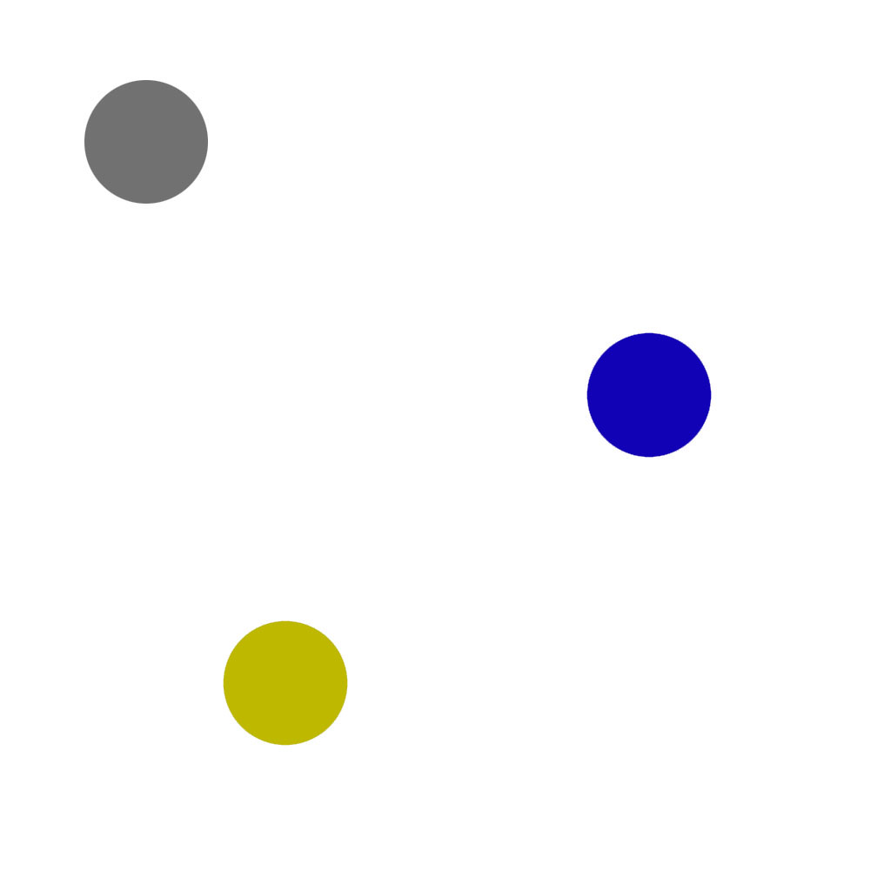
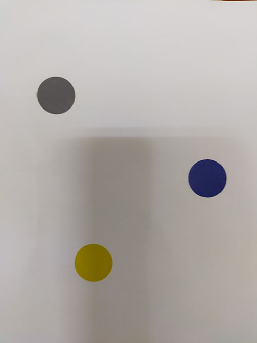
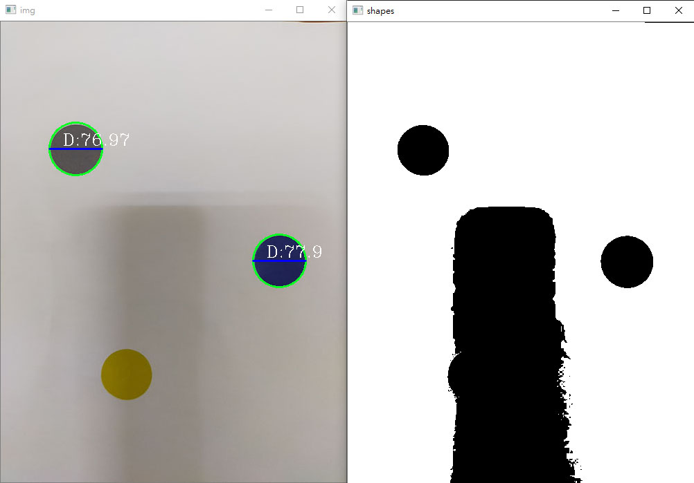
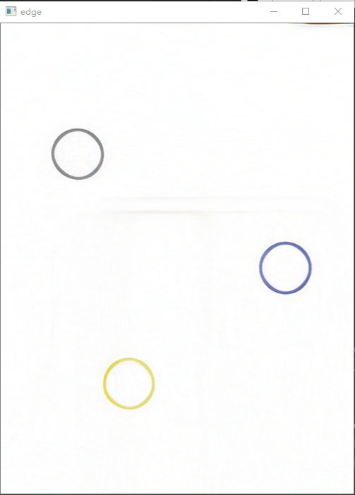
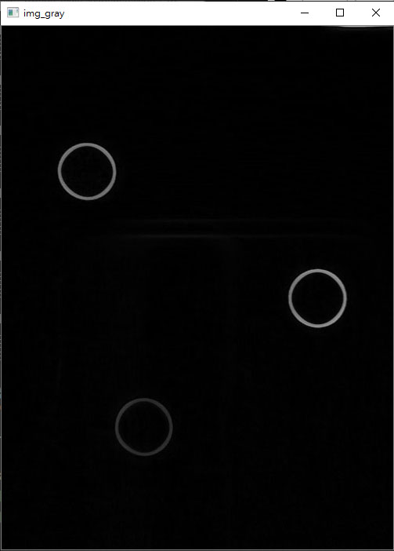
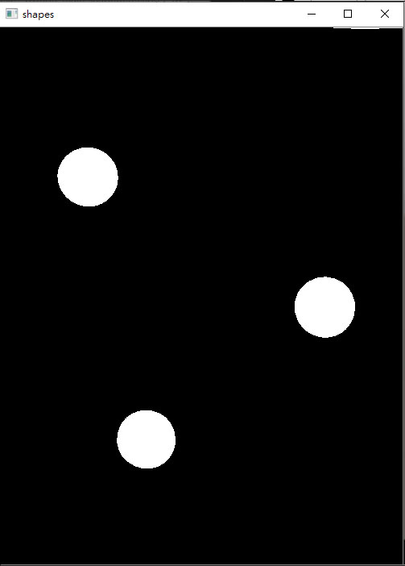
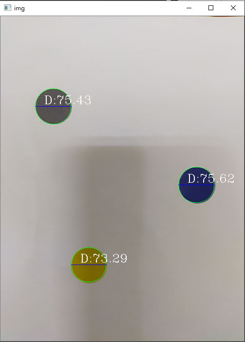

# 移除影子

在電腦上的圖片不會產生影子、對比度高，但在現實中影子無處不在，以致增加偵測困難，

所以必須先處理影子問題，才能提高判斷準確度。以下是用判斷是利用圓形判斷並畫取直徑來做示範:

- 電腦圖片

- 現實情況

## 原先結果

## 處裡方式

- 抓取邊緣

      edge_planes = []
      # result_norm_planes = []
      for plane in rgb_planes:
          dilated_img = cv2.dilate(plane, np.ones((7,7), np.uint8))
          bg_img = cv2.medianBlur(dilated_img, 21)
          diff_img = 255 - cv2.absdiff(plane, bg_img)
          norm_img = cv2.normalize(diff_img,None, alpha=0, beta=255, norm_type=cv2.NORM_MINMAX, dtype=cv2.CV_8UC1)
          edge_planes.append(diff_img)
          # result_norm_planes.append(norm_img)

      edge = cv2.merge(edge_planes)

- 轉成灰階並反轉

      img_gray = cv2.cvtColor(edge,cv2.COLOR_BGR2GRAY)
      img_gray = 255 - img_gray

- 填滿顏色

      # Copy the thresholded image
      im_floodfill = thrash.copy()

      # Mask used to flood filling.
      # NOTE: the size needs to be 2 pixels bigger on each side than the input image
      h, w = thrash.shape[:2]
      mask = np.zeros((h+2, w+2), np.uint8)

      # Floodfill from point (0, 0)
      cv2.floodFill(im_floodfill, mask, (0,0), 255)

      # Invert floodfilled image
      im_floodfill_inv = cv2.bitwise_not(im_floodfill)

      # Combine the two images to get the foreground
      im_out = thrash | im_floodfill_inv

## 重新判斷結果

當把影子先處理後並將偵測的邊緣填滿顏色，在判斷圓形形狀的時候，判斷準確度提高不少，

影子遮蔽的圓形圖案在這次實驗中順利做偵測判斷。

